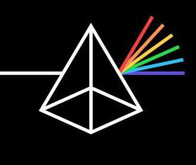

# 🛡️ TruthLens AI

<p align="center">



</p>

<h3 align="center">
AI-Powered Fact Verification & News Credibility Platform
</h3>

<p align="center">

Verify claims using AI, trusted news sources, semantic similarity, and Natural Language Inference.

</p>

---

## 📖 Overview

TruthLens AI is an intelligent fact-checking platform that helps users verify the authenticity of news, articles, and factual claims.

Instead of relying on a single source, TruthLens searches multiple trusted news providers, compares evidence using semantic similarity, analyzes whether evidence **supports**, **contradicts**, or is **neutral** toward a claim, and generates a confidence-based verdict.

The project is built with a **React frontend** and a **FastAPI backend**, using an **ONNX-optimized Natural Language Inference model** for lightweight and deployment-friendly AI inference.

---

# ✨ Features

## 🔍 Claim Verification

- Verify factual claims in seconds
- AI-based verdict generation
- Confidence score
- Supporting vs Contradicting evidence
- Neutral evidence detection

---

## 📰 News Verification

- Searches trusted news APIs
- Retrieves multiple evidence articles
- Removes duplicate domains
- Compares articles using semantic similarity
- Displays evidence with credibility scores

---

## 🌐 URL Fact Checking

Paste any news article URL.

TruthLens will:

- Extract article content
- Search independent sources
- Compare claims
- Detect misinformation
- Show supporting evidence

Supports:

- Newspaper3k
- Trafilatura
- BeautifulSoup

---

## 🤖 AI Assistant

Ask questions naturally like:

> Did Apple sue OpenAI?

> Is climate change real?

> Did India land on the Moon?

The assistant automatically converts questions into claims and performs full fact verification.

---

## 📚 History

- Save every verification
- View previous fact checks
- Delete individual history
- Clear complete history

---

## ❤️ Saved Checks

Bookmark important fact checks for later reference.

---

## 📊 Dashboard Statistics

Displays

- Total Checks
- True Claims
- False Claims
- Uncertain Claims

---

# 🧠 AI Pipeline

TruthLens uses multiple AI techniques instead of relying solely on LLMs.

```
User Claim
      │
      ▼
Search News APIs
      │
      ▼
Retrieve Articles
      │
      ▼
TF-IDF Semantic Similarity
      │
      ▼
ONNX DistilBERT NLI Model
      │
      ▼
Entailment
Contradiction
Neutral
      │
      ▼
Confidence Calculation
      │
      ▼
Final Verdict
```

---

# ⚙️ Tech Stack

## Frontend

- React.js
- React Router
- Axios
- SweetAlert2
- CSS3

---

## Backend

- FastAPI
- Python
- Uvicorn

---

## Database

- MongoDB
- PyMongo

---

## AI

- ONNX Runtime
- DistilBERT MNLI
- HuggingFace Tokenizer
- TF-IDF
- Cosine Similarity

---

## Article Extraction

- Newspaper3k
- Trafilatura
- BeautifulSoup

---

## Authentication

- JWT
- Passlib

---

# 📂 Project Structure

```
TruthLens/

│

├── backend/

│ ├── app.py

│ ├── database.py

│ ├── auth.py

│ ├── services/

│ │ ├── search.py

│ │ ├── fact_checker.py

│ │ ├── verifier.py

│ │ ├── article_extractor.py

│ │ └── explainer.py

│

│ ├── models/

│ │ ├── model.onnx

│ │ ├── tokenizer.json

│ │ ├── vocab.txt

│ │ └── config.json

│

└── frontend/

├── src/

├── pages/

├── components/

└── App.js
```

---

# 🚀 Installation

## Clone Repository

```bash
git clone https://github.com/Prateek-Dhar-Dwivedi/TruthLens.git

cd TruthLens
```

---

## Backend

```bash
cd backend

pip install -r requirements.txt

uvicorn app:app --reload
```

Backend

```
http://localhost:8000
```

---

## Frontend

```bash
cd frontend

npm install

npm start
```

Frontend

```
http://localhost:3000
```

---

# 🔐 Environment Variables

Create a `.env`

```env
MONGO_URI=your_mongodb_uri

JWT_SECRET=your_secret

NEWS_API_KEY=your_news_api_key
```

---

# 📷 Screenshots

## Home

(Add Screenshot)

---

## Fact Check

(Add Screenshot)

---

## AI Assistant

(Add Screenshot)

---

## Dashboard

(Add Screenshot)

---

# 📈 Future Improvements

- Voice Assistant
- Browser Extension
- Multi-language Support
- Real-time Breaking News Verification
- AI-generated Explanations
- Source Bias Detection
- Fake Image Detection
- Social Media Fact Checking

---

# 👨‍💻 Author

## Prateek Dhar Dwivedi

B.Tech Computer Science (AI & ML)

---

### GitHub

https://github.com/Prateek-Dhar-Dwivedi

### LinkedIn

https://www.linkedin.com/in/prateek-dhar-dwivedi/

---

# ⭐ If you like this project

Give it a ⭐ on GitHub.

It helps others discover the project and motivates future improvements.

---

## License

This project is licensed under the MIT License.
