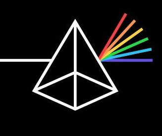

# 🛡️ TruthLens AI

<p align="center">

</p>

<h3 align="center">
AI-Powered Fact Verification & News Credibility Platform
</h3>

<p align="center">
Verify claims, analyze news articles, and detect misinformation using AI-powered Natural Language Inference, semantic similarity, and trusted news sources.
</p>

---

# 📖 Overview

TruthLens AI is an intelligent fact-checking platform that helps users verify factual claims, analyze news articles, and identify misinformation.

Instead of relying on a single article or AI model, TruthLens combines:

- Trusted News APIs
- AI-powered Natural Language Inference (ONNX)
- Semantic Similarity (TF-IDF)
- URL Article Extraction
- Evidence Analysis
- AI Assistant

The platform determines whether available evidence **supports**, **contradicts**, or is **neutral** toward a claim before generating a confidence-based verdict.

---

# ✨ Features

## 🔍 AI Fact Checking

- Verify factual claims instantly
- AI-generated verdict
- Confidence score
- Supporting evidence
- Contradicting evidence
- Neutral evidence
- Source credibility indicators

---

## 🤖 AI Assistant

Ask questions naturally:

> Did Apple sue OpenAI?

> Is climate change real?

> Did India land on the Moon?

The assistant automatically converts questions into factual claims and performs complete verification.

---

## 🌐 URL Fact Checking

Paste any article URL.

TruthLens automatically:

- Extracts article content
- Searches independent news sources
- Compares evidence
- Detects misinformation
- Generates AI verdict

Supported extraction engines:

- Newspaper3k
- Trafilatura
- BeautifulSoup

---

## 📰 News Verification

- Searches multiple trusted news sources
- Removes duplicate articles
- Semantic relevance filtering
- Natural Language Inference
- Source comparison
- Evidence visualization

---

## 📚 History

- Save every verification
- View previous searches
- Delete individual records
- Clear history

---

## ⭐ Saved Checks

Bookmark important fact checks for future reference.

---

## 📊 Dashboard

Real-time statistics including:

- Total Checks
- True Claims
- False Claims
- Uncertain Claims

---

# 🧠 AI Pipeline

```
User Claim
      │
      ▼
Search News APIs
      │
      ▼
Retrieve Articles
      │
      ▼
Semantic Similarity
(TF-IDF + Cosine Similarity)
      │
      ▼
Relevant Evidence
      │
      ▼
Quantized ONNX DistilBERT
Natural Language Inference
      │
      ▼
Entailment
Contradiction
Neutral
      │
      ▼
Confidence Calculation
      │
      ▼
Final Verdict
```

---

# ⚡ AI Optimization

Unlike traditional deployments that require hundreds of megabytes of deep learning frameworks, TruthLens uses an optimized ONNX inference pipeline.

### Model

- DistilBERT MNLI
- INT8 Quantized ONNX Model
- Hosted on Hugging Face
- Downloaded automatically during deployment

Benefits:

- Faster inference
- Lower memory usage
- Lightweight deployment
- Production-ready architecture

---

# ⚙️ Tech Stack

## Frontend

- React.js
- React Router
- Axios
- SweetAlert2
- CSS3

---

## Backend

- FastAPI
- Python
- Uvicorn

---

## Database

- MongoDB
- PyMongo

---

## AI & Machine Learning

- ONNX Runtime
- Quantized DistilBERT MNLI
- Hugging Face Hub
- Transformers Tokenizer
- TF-IDF
- Cosine Similarity

---

## Article Extraction

- Newspaper3k
- Trafilatura
- BeautifulSoup

---

## Authentication

- JWT
- Passlib

---

# 📂 Project Structure

```
TruthLens
│
├── backend
│   ├── app.py
│   ├── auth.py
│   ├── database.py
│   ├── services
│   │     ├── article_extractor.py
│   │     ├── fact_checker.py
│   │     ├── verifier.py
│   │     ├── search.py
│   │     └── explainer.py
│   │
│   └── requirements.txt
│
├── frontend
│   ├── src
│   ├── pages
│   ├── components
│   └── App.js
│
└── README.md
```

---

# 🚀 Installation

## Clone Repository

```bash
git clone https://github.com/Prateek-Dhar-Dwivedi/TruthLens.git

cd TruthLens
```

---

## Backend

```bash
cd backend

pip install -r requirements.txt

uvicorn app:app --reload
```

Backend:

```
http://localhost:8000
```

---

## Frontend

```bash
cd frontend

npm install

npm start
```

Frontend:

```
http://localhost:3000
```

---

# 🔐 Environment Variables

Create a `.env` file inside the backend directory.

```env
MONGO_URI=your_mongodb_uri

JWT_SECRET=your_secret_key

NEWS_API_KEY=your_news_api_key
```

---

# 🌐 Deployment

TruthLens is designed for lightweight cloud deployment.

- Frontend → Vercel
- Backend → Render
- AI Model → Hugging Face Hub
- Database → MongoDB Atlas

The ONNX model is **not stored inside the repository**.

During deployment it is downloaded automatically from Hugging Face using:

- Hugging Face Hub
- ONNX Runtime

This keeps the repository lightweight while ensuring fast startup and inference.

---

# 📈 Future Improvements

- Browser Extension
- Voice Assistant
- Multi-language Support
- Source Bias Detection
- Image Fact Checking
- Video Fact Checking
- Social Media Verification
- Real-time Breaking News Detection
- Explainable AI Reasoning
- Citation Quality Ranking

---

# 👨‍💻 Author

## Prateek Dhar Dwivedi

**B.Tech Computer Science & Engineering (AI & ML)**

### GitHub

https://github.com/Prateek-Dhar-Dwivedi

### LinkedIn

https://www.linkedin.com/in/prateek-dhar-dwivedi/

---

# ⭐ Support

If you found this project useful, consider giving it a ⭐ on GitHub.

It helps others discover the project and supports future development.

---

# 📄 License

This project is licensed under the MIT License.
